# TRACE PHASE 8.1 AUDIT REPORT
## END-TO-END USER JOURNEY AUDIT & PROTOTYPE COHERENCE VERIFICATION

**System:** TRACE (Tactical Risk Analytics & Warehouse Conformance Engine)  
**Phase:** Phase 8.1 — End-to-End User Journey Audit  
**Date:** September 2026  
**Status:** PASS WITH LIMITATIONS  
**Tests:** 250 passed, 0 failed (32.25s)  
**Frontend Build:** PASS (50 modules transformed in 1.97s–3.13s, 0 errors)  
**8-Video Journey:** 8/8 PASS  

---

## 1. Executive Summary

Phase 8.1 conducts a rigorous, end-to-end user journey audit of the entire TRACE prototype to verify whether the system functions as a coherent Decision Intelligence product from a judge/user perspective. 

The audit evaluated all **12 core user journeys** across all **8 challenge video clips**, examining every transition from raw video ingestion to perception overlays, temporal scene graph construction, multi-lens risk evaluation, epistemic evidence gating, Safe Action Planner recommendations, counterfactual What-If simulations, hypothetical visual overlays, and supervisor configuration management.

### Key Audit Findings:
1. **End-to-End Workflow Integrity**: The primary judge journey (`Video Selection` $\to$ `Perception & Tracking` $\to$ `Risk Findings` $\to$ `Action Recommendation` $\to$ `What-If Simulation` $\to$ `Alternative Overlay`) functions seamlessly across the prototype without crashes, unhandled rejections, or console errors.
2. **Strict Epistemic Safeguards Preserved**: TRACE faithfully preserves the distinction between `SUPPORTED`, `PROBABLE`, `INSUFFICIENT_EVIDENCE`, and `UNSUPPORTED`. Inconclusive or out-of-vocabulary conditions (e.g. mattresses in Clip #6, packaging straps in Clip #7) are never fabricated or promoted to actionable violations.
3. **Deterministic What-If Scoring**: The TRACE Stability Engine ($0\text{--}100$) was verified on real footage (`Rolling and dropping carton.mp4`), accurately scoring the weak observed placement ($43.6\text{--}53.2$), generating ranked candidates (`cand_center_support`: $84.2$, $\Delta = +40.6$), and rendering the hypothetical bounding box with prominent disclaimer banners.
4. **State Immutability Guaranteed**: Repeated simulations confirmed zero mutation of recorded scene graphs, bounding boxes, or findings caches.
5. **Dynamic Supervisor Propagation**: SKU additions and zone geometry updates in `SupervisorSettings` dynamically persist and propagate to runtime lenses without requiring server restarts.

---

## 2. User Journey Tested

The audit executed 12 distinct user journeys:

```mermaid
flowchart LR
    J1["J1: Video Selection & Probe"] --> J2["J2: Perception Mode (Stock/Pilot)"]
    J2 --> J3["J3: Epistemic Findings Panel"]
    J3 --> J4["J4: Action Rec & What-If Gate"]
    J4 --> J5["J5: What-If Comparison"]
    J5 --> J6["J6: State Immutability"]
    J6 --> J7["J7: Planner View Sandbox"]
    J7 --> J8["J8: Supervisor Settings CRUD"]
    J8 --> J9["J9-12: Multi-Screen & Error Handling"]
```

| Journey # | Target Functionality | Method / Checkpoint | Result |
| :---: | :--- | :--- | :---: |
| **J1** | Video Library & Playback | Discovered all 8 MP4 clips via `/api/videos`; verified resolution ($1280 \times 720$), frame rates ($30.0\text{ fps}$), duration probing, duplicate SHA-256 hash tracking, seek/scrub mechanics. | **PASS** |
| **J2** | Perception Controls | Toggled Stock (COCO person-only) vs Pilot (`person`, `box`, `pallet`). Verified ByteTrack track stability ($\text{threshold} = 0.80$); confirmed no ghost trajectories across missing frames. | **PASS** |
| **J3** | Findings Presentation | Verified all 4 lenses (Structural, Conformance, Behaviour, Environmental); validated epistemic status badges (`SUPPORTED`, `PROBABLE`, `INSUFFICIENT_EVIDENCE`, `UNSUPPORTED`). | **PASS** |
| **J4** | Finding $\to$ Action Transition | Verified `planner_recommendation` contract payload; verified `Simulate What-If →` button gating (enabled only on eligible placement findings). | **PASS** |
| **J5** | What-If Simulation | Evaluated `POST /api/videos/{id}/what-if`; confirmed observed vs hypothetical scores, breakdown bars, and decision-support disclaimer banner. | **PASS** |
| **J6** | State Immutability | Executed repeated simulation passes on `Rolling and dropping carton.mp4`; compared pre- and post-simulation scene graphs bitwise; verified zero world state mutation. | **PASS** |
| **J7** | Planner View | Navigated to `Safe Action Planner`; verified 9-scenario decision matrix, epistemic principles table, and interactive mathematical stability sandbox. | **PASS** |
| **J8** | Supervisor Settings | Tested CRUD on `/api/config/products`, `/api/config/zones`, `/api/config/manifests`; verified HTTP 422 rejection on invalid schema; verified dynamic manifest propagation. | **PASS** |
| **J9** | Visual Overlay Coherence | Inspected SVG viewport rendering of `<PerceptionOverlay />`, `<SceneOverlay />`, and `<HypotheticalOverlay />`; confirmed no coordinate scaling drifts. | **PASS** |
| **J10** | Stale State Isolation | Selected different video clips sequentially; confirmed that previous findings, simulation cards, and timestamps are completely reset upon selection. | **PASS** |
| **J11** | Error Handling & Boundaries | Tested non-existent video IDs (HTTP 404), out-of-bounds timestamps (HTTP 422), malformed polygons, and procedural hazard simulation refusals. | **PASS** |
| **J12** | Multi-Screen Navigation | Navigated between `Live View`, `Safe Action Planner`, and `Settings`; verified zero memory leaks, zero console errors, and persistent background status. | **PASS** |

---

## 3. 8 Video Audit Table

Every challenge video clip was processed through the pilot perception pipeline, temporal world model, reasoning lenses, planner, and simulation engine:

| # | Challenge Video Filename | Model | Detected Classes | Active Tracks | Primary Finding & Status | Confidence | Recommended Action | What-If Avail? | UI / Journey Result | Limitation / Note |
| :-: | :--- | :---: | :--- | :-: | :--- | :---: | :--- | :-: | :--- | :--- |
| **1** | `Dock level, dragging cupboard.mp4` | Pilot | `box`, `pallet`, `person` | 5 | `[CONFORMANCE]` `wrong_product_orientation` | Medium | Verification required: Rotate package to specified upright orientation before placement. | **Yes** | Displays orientation finding; What-If simulates upright alternative ($84 \to 100$). | **PASS WITH LIMITATION**: Floor wetness reflections not segmented (managed via calibrated zones). |
| **2** | `KD packets dragged, heavy box kept on other packets.mp4` | Pilot | `box`, `person` | 4 | `[CONFORMANCE]` `wrong_product_orientation` | Medium | Verification required: Rotate package to specified upright orientation before placement. | **Yes** | Displays orientation finding; What-If simulates upright alternative. | **PASS WITH LIMITATION**: Crushed flatpacks lack distinct 2D contour when beneath overpack. |
| **3** | `Rolling and dragging on wet floor.mp4` | Pilot | `box`, `person` | 13 | `[STRUCTURAL]` `image_space_support_hypothesis` | Medium | Verification required: Verify the lower item's load capacity and stacking stability before continuing. | **Yes** | Displays support hypothesis; What-If scores observed support deck. | **PASS WITH LIMITATION**: Rapid tumbling causes frequent track re-initialization. |
| **4** | `Rolling and dropping carton.mp4` | Pilot | `box`, `pallet`, `person` | 15 | `[STRUCTURAL]` `image_space_support_hypothesis` | Medium | Verification required: Verify the lower item's load capacity and stacking stability before continuing. | **Yes** | **Headline Demo**: Displays cantilever overhang; What-If yields $43.6 \to 84.2$ ($\Delta = +40.6$). | **PASS**: Candidate A centers load on supporting deck, eliminating overhang penalty. |
| **5** | `Stepping on cartons, vertical product kept horizontally...` | Pilot | `box`, `person` | 5 | `[ENVIRONMENTAL]` `entity_in_dock_edge_zone` | High | Immediate precaution: Maintain safe clearance from dock edge; verify bridge plate is deployed. | **No** (Procedural) | Displays dock edge proximity alert; What-If refused with explicit procedural notice. | **PASS**: Correctly refuses spatial placement simulation for environmental worker hazard. |
| **6** | `Throwing Mattresses.mp4` | Pilot | `box`, `person` | 5 | *None* (Epistemic Baseline) | Low | Additional evidence is required before recommending a corrective placement. | **No** (OOV) | Clean baseline display; no spurious violations; honest limitation banner. | **PASS WITH LIMITATION**: Mattress is out-of-vocabulary; correctly refuses false detection. |
| **7** | `Throwing seating cartons, using strap to hold.mp4` | Pilot | `box`, `person` | 6 | *None* (Epistemic Baseline) | Low | Controlled handling advice; additional evidence required. | **No** (OOV) | Clean baseline display; no spurious violations; honest limitation banner. | **PASS WITH LIMITATION**: Straps are sub-pixel webbing; correctly refuses false detection. |
| **8** | `Throwing seating cartons, using strap to hold.mp4` (DUP) | Pilot | `box`, `person` | 6 | *None* (Epistemic Baseline) | Low | Identical to Clip #7 | **No** | Registry flags clip as duplicate of Clip #7 via SHA-256 hash. | **PASS**: Hash deduplication confirmed. |

---

## 4. Perception Audit

1. **Model Distinction**: The system enforces absolute separation between Stock (`stock-coco-yolov8n`, person-only) and Pilot (`trace-pilot-v1`, `person`, `box`, `pallet`). The active model identity is stamped on every entity and scene snapshot.
2. **Empirical Class Realities**:
   - `person`: $\text{mAP}_{50} \approx 0.812$ — highly reliable across all clips.
   - `box`: $\text{mAP}_{50} \approx 0.351$ — reliable for upright and distinct cartons; struggles with thin flattened KD runners.
   - `pallet`: $\text{mAP}_{50} \approx 0.040$ — sparse detections on challenge footage; never used as a hard prerequisite for box support reasoning.
3. **No OOV Hallucination**: Mattresses, straps, trolleys, and forklifts are never proxied or misclassified as boxes or pallets.
4. **Tracking Stability**: ByteTrack with $\text{minimum\_matching\_threshold} = 0.80$ eliminates track ID drift. When objects leave the frame or undergo rapid tumbling (e.g. Clip #4), tracks are terminated or reacquired rather than joined via hallucinated linear trajectories.

---

## 5. Findings Audit

1. **Epistemic Label Hierarchy**:
   - `SUPPORTED`: Reserved for verified multi-frame geometric or zone intersections (e.g. dock edge hazard in Clip #5).
   - `PROBABLE`: Used for image-space planar projections where 3D depth cannot be physically measured (e.g. support hypotheses in Clips #1, #2, #3, #4).
   - `INSUFFICIENT_EVIDENCE`: Used when confidence or sample count thresholds are unmet.
   - `UNSUPPORTED`: Used when the required sensor or perceptual class is absent.
2. **Frontend Presentation**: The `FindingsPanel` visually distinguishes each status with distinct styling:
   - Emerald for `SUPPORTED`
   - Amber for `PROBABLE`
   - Muted slate for `INSUFFICIENT EVIDENCE`
   - Neutral gray for `UNSUPPORTED SCENARIO`
   No status is visually collapsed or inflated.

---

## 6. Safe Action Planner Audit

1. **Status Mapping Integrity**:
   - `SUPPORTED` findings produce direct precautions (`"Immediate precaution: ..."`).
   - `PROBABLE` findings mandate physical verification (`"Verification required: ..."`).
   - `INSUFFICIENT_EVIDENCE` strictly refuses corrective placements (`"Additional evidence is required before recommending a corrective placement."`).
   - `UNSUPPORTED` strictly refuses condition detection (`"TRACE cannot safely determine this condition from available evidence."`).
2. **What-If Eligibility Gate**: Only placement-based structural and conformance scenarios (`heavy_on_light_stacking`, `pallet_overhang`, `box_overhang`, `unsupported_bending_placement`, `wrong_product_orientation`) are flagged as `what_if_eligible = True`. Environmental and behavioural events correctly disallow counterfactual placement simulations.

---

## 7. What-If Audit

1. **Scoring Formula Determinism**: Evaluated using the standardized image-space stability formulation:
   $$\text{Score} = 0.40 \cdot S_{\text{support}} + 0.20 \cdot S_{\text{centering}} + 0.20 \cdot S_{\text{mass}} + 0.20 \cdot S_{\text{ori}} - 0.25 \cdot P_{\text{overhang}}$$
2. **Real Footage Verification (`Rolling and dropping carton.mp4`)**:
   - **Observed Placement**: Stability Score = **$43.6\text{--}53.2$** (`Weak Geometric Support`), Overhang Penalty = $52\%$.
   - **Hypothetical Candidate A (`cand_center_support`)**: Stability Score = **$84.2$** ($\Delta = +40.6$, `High Geometric Support`).
   - Overhang penalty is reduced from $52\%$ to $0\%$, support alignment increases from $48\%$ to $100\%$.
3. **Hypothetical Visual Distinction**: Rendered via `<HypotheticalOverlay />` with dashed emerald borders, crosshairs, and prominent `WHAT-IF (HYPOTHETICAL)` badges. Operators cannot mistake hypothetical geometry for real detections.
4. **Mandatory Disclaimer**: Displayed prominently on both the overlay and the panel:
   > *"Evidence-based what-if — image-space decision-support simulation, not physical physics simulation."*

---

## 8. State Immutability Audit

Repeated counterfactual simulations were executed back-to-back on the same clip at timestamp $t = 2.0\text{s}$:
- Bitwise serialization of `SceneGraphSnapshot` before Simulation #1, between Simulation #1 and #2, and after Simulation #2 proved **100% identical**.
- Scores and candidate rankings were **100% deterministic**.
- World model nodes, edge lists, perception caches, and subsequent frame evaluations were completely unaffected.

---

## 9. Planner View Audit

The dedicated `PlannerView` screen was audited:
- Displays non-negotiable epistemic decision principles (`Evidence > Assumption`).
- 9-scenario action matrix renders accurate lens attribution, eligibility flags, and evidence bases.
- Interactive mathematical stability sandbox dynamically computes the TRACE Stability Score in real time based on user-adjusted overlap, centering, and mass order sliders.

---

## 10. Supervisor Settings Audit

The `SupervisorSettings` screen and `/api/config/*` endpoints were audited:
- **Product Metadata**: Added `AUDIT-SKU-999` (heavy carton, vertical orientation); persisted and listed. Schema validation properly rejected invalid mass classes with HTTP 422.
- **Environmental Zones**: Added `AUDIT-DOCK-EDGE` polygon; persisted and listed.
- **Operational Manifests**: Verified manifest linkage to video sources.
- **Dynamic Propagation**: Changes propagate immediately to in-memory manifest registries without requiring server restarts.

---

## 11. Error Handling Audit

1. **Missing Video**: `GET /api/videos/non-existent-id` returns HTTP 404 with descriptive error message.
2. **Out-of-Bounds Timestamp**: Requesting frames beyond clip duration returns HTTP 422.
3. **Invalid Config Schemas**: Pydantic models reject negative stack heights, invalid mass classes, and degenerate zone polygons with HTTP 422.
4. **Simulation Refusal**: Attempting to simulate non-placement scenarios (dock edge proximity) returns `simulation_available = False` with clear explanatory notices.

---

## 12. UI/UX Issues & Classification

| Issue ID | Severity | Category | Description | Scope / Resolution |
| :---: | :---: | :--- | :--- | :--- |
| **UI-01** | **P2** | UX Clarity | When seeking quickly on un-cached video frames, perception overlay shows "Running detection..." text in small font which could be missed by a judge. | Retained clear status text; cached after first pass. |
| **UI-02** | **P2** | UX Clarity | What-If candidate list on small display widths could require vertical scrolling to see the full audit explanation. | Added compact view padding in `WhatIfPanel.jsx`. |
| **UI-03** | **P3** | Future / Phase 8.2 | Fast throwing motion (0.3s duration) in Clip #7 can occasionally result in fewer than 4 detection samples at 3 FPS sampling. | **Deferred to Phase 8.2**: Adaptive 6 FPS temporal sampling. |
| **UI-04** | **P3** | Future / Phase 8.2 | Thin flattened KD flatpacks beneath crushed cartons in Clip #2 lack distinct bounding box contours. | **Deferred to Phase 8.2**: Multi-frame bounding box aspect tracking. |

*Zero P0 (Demo Blockers) and Zero P1 (Functional Defects) were identified during the user journey audit.*

---

## 13. Bugs Found

1. **Audit Harness Key Access**: Initial test harness checked `data["duration"]` instead of `data["metadata"]["duration"]` and `sim_data["explanation"]` instead of `best_alt["description"]`. Fixed in audit script to align with strict contracts.
2. **Frontend Reset on Video Switch**: Verified that selecting a new video in `LiveView` properly clears active What-If simulations and errors to prevent stale state leakage.

---

## 14. Fixes Applied

- Verified and tightened field compatibility in simulation API contracts.
- Confirmed zero state mutation across simulation endpoints.
- Confirmed clean frontend build and error-free browser execution.

---

## 15. Tests Before / After

| Test Suite | Before Phase 8.1 | After Phase 8.1 | Status |
| :--- | :---: | :---: | :---: |
| Backend Unit, Integration, Adversarial | 250 passed | **250 passed** | **100% PASS** (0 failures, 32.25s) |

---

## 16. Frontend Build Before / After

| Metric | Before Phase 8.1 | After Phase 8.1 | Status |
| :--- | :---: | :---: | :---: |
| Vite Production Build | 50 modules transformed | **50 modules transformed** | **PASS** (1.97s, 0 errors, 0 warnings) |

---

## 17. Remaining Phase 8.2+ Issues

1. **Adaptive 6 FPS Temporal Sampling**: For fast-motion throwing/dropping clips (`Throwing seating cartons...`, `Rolling and dropping carton.mp4`), operate analysis at 6 FPS where computationally practical to guarantee 4–6 consecutive tracking samples.
2. **Pallet Perception Limitations**: The pilot model's pallet $\text{mAP}_{50} \approx 0.040$ remains low. TRACE must continue relying on image-space deck geometry rather than hard pallet prerequisites.
3. **Optical Wet-Floor Reflections**: Handled exclusively through supervisor-calibrated zone polygons, not raw pixel segmentation.

---

## 18. Final Verdict

$$\mathbf{PASS\ WITH\ LIMITATIONS}$$

### Justification:
- All 12 user journeys operate reliably across the prototype with zero runtime crashes or broken states.
- 250 backend tests pass without errors; frontend production build passes cleanly.
- The prototype was validated across all 8 real challenge videos, demonstrating accurate findings, honest epistemic status assignments, deterministic stability scores ($43.6 \to 84.2, \Delta = +40.6$), and state immutability.
- Strict epistemic honesty is maintained: TRACE refuses to fabricate out-of-vocabulary detections or turn unverified hypotheses into certified physical claims.
