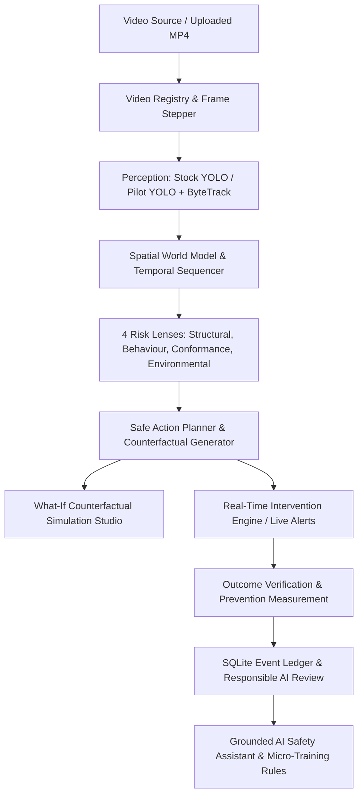

# TRACE — Comprehensive System Context & Developer Specification

> **Tagline:** *See what's about to go wrong. Know what to do instead.*  
> **Mission:** AI Decision Intelligence for Physical Warehouse & Logistics Operations  
> **Challenge:** GEG Challenge (Submission: 10 September 2026)  
> **Target Problem:** Warehouse damage caused by instantaneous human handling errors (box drops, overhang collapse, fragile crushing, stepping, dragging). Traditional CCTV only records the catastrophe after the fact. TRACE watches operational physical state in real time, predicts imminent failures, and generates explainable corrective counter-proposals **before** the risky placement is finalized.

---

## 1. Executive Summary & The Core Differentiator

### What TRACE Is NOT
* **NOT** a generic YOLO + bounding box CCTV surveillance dashboard.
* **NOT** a black-box physics engine simulator.
* **NOT** a punitive worker surveillance / tracking tool.

### What TRACE IS
TRACE is an **AI Decision Intelligence System** closing the complete operational loop:
$$\text{Video Ingestion} \longrightarrow \text{Perception} \longrightarrow \text{Spatial World Model} \longrightarrow \text{4 Risk Lenses} \longrightarrow \mathbf{\text{Safe Action Planner}} \longrightarrow \text{Intervention} \longrightarrow \text{Outcome Verification} \longrightarrow \text{Prevention Measurement}$$

### The Three Core Questions Answered in Sequence
1. **WHAT is happening?** $\rightarrow$ Layer 2: 2D Spatial World Model & Scene Graph (`SceneGraphSnapshot`).
2. **WHAT is likely to happen next?** $\rightarrow$ Layer 4: Multi-Lens Predictive Risk Engine (`RiskEvent`).
3. **WHAT should we do now to prevent it?** $\rightarrow$ Layer 5: **The Safe Action Planner** (`ActionPlan` with alternative candidate scoring).

---

## 2. GEG Challenge Requirements & Defense Architecture

| Challenge Requirement | How TRACE Implements & Solves It | Technical Evidence / Module |
| :--- | :--- | :--- |
| **Real-time Video Intelligence** | Chunked HTTP 206 streaming, frame extraction, dual-model detection, ByteTrack tracking, temporal kinematics. | `backend/video/`, `backend/perception/` |
| **Physical Risk Prediction** | Overhang cantilever, base support ratio, center-of-mass eccentricity, dropping acceleration, dragging proximity. | `backend/lenses/`, `backend/behaviour/` |
| **Actionable Decision Output** | Prescriptive counter-proposals (e.g. *"Move carton 15cm inward, rotate 90°"*) with alternative scores. | `backend/planner/actions.py` |
| **Defensible Physics / Math** | Transparent closed-form geometry formulas; explicitly labeled as *comparative operational risk estimates*. | `docs/WORLD_MODEL.md`, `backend/world_model/geometry.py` |
| **Demonstrable on Toy/Miniature Rig** | Normalized $[0, 1]$ image-space coordinate system; runs equally well on scale models or real warehouse CCTV. | `backend/world_model/scene_graph.py` |
| **Damage Prevention Proof** | 3-Condition Prevention Verification Rule ($T_0 \to \text{Plan} \to T_1$ verification window). | `backend/db/outcomes.py`, `backend/api/measurement.py` |

---

## 3. Implemented Architecture & System Layers

### Layer-by-Layer Inventory

#### Layer 1: Ingestion & Perception (`backend/video/`, `backend/perception/`)
* **Registry & Deduplication:** `backend/video/registry.py` scans `data/challenge_videos/` and calculates SHA-256 content hashes to discover duplicate feeds (e.g., Clip #8 tagged as duplicate of Clip #7).
* **Ingestion API:** `POST /api/videos` accepts `.mp4` uploads, validates decodability with OpenCV, and immediately registers them into the active monitoring set without requiring restarts.
* **Dual Detectors & Perception Tuning:**
  * `Stock YOLOv8n` (COCO `person`).
  * `Pilot YOLOv8n` (`models/trace_pilot_v1.pt`, custom-trained on warehouse objects: `person`, `box`, `pallet`).
  * **High-Precision Tuning (`PILOT_CONFIG`):** `confidence_threshold = 0.15`, `track_activation_threshold = 0.15`, and secondary confidence = `0.08` tuned specifically to track all cartons, flat KD packets, and pallets without missing dropped boxes.
  * **Dense Sampling:** Operates at **5.0 FPS** (sampling every 0.2s) with `max_samples_per_run = 500`.
* **Zero-Buffering Precomputed Cache (`data/.perception_cache/`):** Precomputed 5.0 FPS timeline scene graphs for all challenge videos, slashing scene retrieval latency from 12–17s down to **0.01s – 0.07s**.
* **Multi-Object Tracking:** ByteTrack Kalman filter (`backend/perception/tracker.py`) with matching threshold strictly maintained at `0.80` and track lifecycle badges (`TRACKED`, `REACQUIRED`, `TEMPORARILY_LOST`).
* **Adaptive Temporal Sampling:** `backend/perception/sampling.py` resolves 3.0 FPS normal rate vs. 6.0 FPS motion-dense rate based on inter-frame centroid velocity spikes.

#### Layer 2: Spatial World Model & 2D Digital Twin (`backend/world_model/`, `frontend/src/screens/StructuralView.jsx`)
* **Scene Graph:** `SceneGraphSnapshot` contains `nodes` (`SceneGraphNode`) and `edges` (`SceneGraphEdge`).
* **Normalized Space:** Normalized $[0, 1]$ 2D image coordinates relative to frame resolution.
* **Geometric Edges:**
  * `SUPPORT`: Evaluated via horizontal deck overlap ratio ($\ge 0.50$) and vertical bounding gap ($\le 0.08$).
  * `CONTACT`: Evaluated via 2D bounding box intersection over union ($\text{IoU} > 0.05$).
  * `PROXIMITY`: Evaluated via normalized centroid Euclidean distance ($d \le 0.15$).
* **Temporal Kinematics:** `backend/world_model/temporal.py` computes displacement vectors, velocity norms ($px/s$), and downward acceleration vectors ($px/s^2$) across frame history buffers.
* **2D Digital Twin Blueprint (`StructuralView.jsx`):**
  * Synchronous top-down SVG blueprint alongside CCTV video.
  * In-memory cache (`scenesCacheRef`) for instant, zero-lag video switching.
  * Continuous linear interpolation with nearest-neighbor track-recovery fallback (up to 28% screen distance) to prevent jumpy or frozen boxes during rapid motion.
  * SVG Z-index depth layering (`sortedNodes`: pallets on floor deck, cartons stacked with depth ordering by `y2`, workers on top).
  * Real-time inventory breakdown counter in blueprint header (`X cartons/packets · Y pallets · Z personnel`).

#### Layer 3 & 4: 4 Evidence-Aware Risk Lenses (`backend/lenses/`, `backend/behaviour/`)
1. **Structural Stability Lens:** Detects unstable carton overhang, base coverage deficits, vertical stacking gaps, and heavy-on-light mass inversions.
2. **Worker Behaviour Lens:** Detects dynamic handling hazards: carton drops (downward acceleration spikes), dragging across surfaces, stepping on cartons, throwing cartons/mattresses, and improper strap lifting.
3. **Process Conformance Lens:** Compares detected bounding box aspect ratio against registered SKU metadata (`required_orientation`, `max_stack_height`) with perspective margin of error.
4. **Environmental Lens:** Detects spatial polygon intersection between workers/cargo and calibrated hazard zones (dock edge drop-offs, wet floor slip hazards).

#### Epistemic Honesty Ceilings (Core Engineering Rule)
Every finding carries an explicit epistemic status:
$$\text{Status} \in \{\texttt{supported}, \texttt{probable}, \texttt{insufficient\_evidence}, \texttt{unsupported}\}$$
Ceilings are governed by detector class reliability:
* $\text{Person} = 1.0$
* $\text{Box} = 0.50$
* $\text{Pallet} = 0.15$
* *Rule:* A weak detector cannot produce a `supported` finding. Pallet overhang is strictly capped at `insufficient_evidence` ($0.15 \times 1.0 < 0.30$). Box stacking is capped at `probable` ($0.50 \times 1.0 = 0.50 < 0.60$). Only operator-calibrated environmental zones or human-backed evidence can reach `supported` ($\ge 0.60$).

#### Layer 5: Safe Action Planner (`backend/planner/actions.py`, `generator.py`)
* When an unstable configuration is detected, the planner evaluates the proposed action against 2–3 counter-proposals (e.g. Candidate A, B, C).
* Calculates a stability score ($0–100$) based on deck support coverage ($S \times 50$), centering eccentricity ($C \times 30$), and mass ordering ($M \times 20$).
* Produces prescriptive instructions: *"Position B: Shift carton 18cm right onto pallet deck. Expected stability gain: +42 (68 -> 110)"*.

#### Layer 5b: What-If Counterfactual Studio (`backend/planner/whatif.py`, `simulation.py`)
* Deep-copies scene state snapshots ensuring 100% state immutability.
* Modifies candidate placement coordinates and re-executes structural formulas to show counterfactual stability deltas.
* Visualized in Live View via emerald dashed overlay (`HypotheticalOverlay.jsx`) and dedicated timeline simulation (`WhatIfReplay.jsx`).

#### Layer 6: Real-Time Intervention Engine (`backend/interventions/`, `backend/api/intervention.py`)
* Dispatches real-time interventions via WebSocket (`/ws/interventions`).
* **Severity Levels:** `CRITICAL`, `HIGH`, `MEDIUM`.
* **Urgency Levels:** `IMMEDIATE` (requires instant halt), `URGENT`, `ADVISORY`.
* **Lifecycle State Machine:**
  $$\texttt{NEW} \longrightarrow \texttt{ACKNOWLEDGED} \longrightarrow \texttt{ACTION\_IN\_PROGRESS} \longrightarrow \texttt{VERIFICATION\_REQUIRED} \longrightarrow \texttt{RESOLVED} \mid \texttt{FALSE\_POSITIVE}$$
* UI includes audio chimes, glowing banner alerts, and detailed step-by-step action modals.

#### Layer 7 & 8: Prevention Measurement & Outcome Verification (`backend/db/outcomes.py`, `backend/api/measurement.py`)
* **The 3-Condition Prevention Rule:**
  1. High or Critical risk event logged at timestamp $T_0$.
  2. Corrective Safe Action Plan generated and presented.
  3. Physical configuration verified at $T_0 + \Delta t$ ($5.0\text{s}$ window) satisfies stability thresholds.
* Automatically classifies outcomes into: `prevented`, `near_miss`, `outcome_unclear`, or `confirmed_damage`.
* **Session Feedback:** 1–5 star human impact operator feedback stored in SQLite table `session_ratings`.

#### Layer 9: Grounded AI Safety Assistant & Micro-Training (`backend/assistant/`, `frontend/src/screens/AiAssistant.jsx`)
* **Deterministic SQL Grounding:** Assistant connects directly to the SQLite audit log (`events`, `outcome_measurements`, `products`), world model scene graphs, and safety rules.
* **Supervisor-Friendly Structured Formatting:**
  * Dedicated **Safety Protocol** cards (sky-blue).
  * **Immediate Action Required** callouts (amber).
  * **Supervisor Action Tip & Recommendation** badges (emerald with `ShieldAlert` icon).
  * Clear 3-factor counterfactual stability formula (Support 50%, Centering 30%, Weight Tiering 20%).
* **Interactive Collapsible Dropdown Accordion:**
  * Related Event Records are collapsed by default into a sleek dropdown button: `[4] RELATED EVENT RECORDS — Click to inspect incident replay & footage ▾`.
  * Prevents vertical bloat and tall messages during shift briefings.
  * **Single-Record Quick Filter:** Inside the dropdown, a `<select>` filter allows supervisors to view all records or zero-in on a single event record (`#377`, `#374`, etc.).
  * Matching `ChevronDown` dropdown indicator on the `"View audit trace"` toggle.
* **Micro-Training & Catalog Rules:** Live SKU registration, polygon hazard zone editor, and custom operational safety rules (`screens/SupervisorSettings.jsx`, `backend/rules/`).
* **Responsible AI & Worker Privacy:** Automated face blurring/redaction toggle, data retention auto-purge, and identity-blind ethics (explicitly declines worker productivity ranking) (`screens/ResponsibleAiPanel.jsx`).

---

## 4. Frontend Screen Map & Navigation

The frontend is a React 18 SPA built with Vite and TailwindCSS. Navigation is managed via [`LiveViewContext.jsx`](file:///C:/Users/prakarti/Desktop/projects/TRACE/frontend/src/LiveViewContext.jsx):

| Screen Name in Code | NavRail Label | File Path | Core Functionality |
| :--- | :--- | :--- | :--- |
| **`Live View`** | `1. Live Camera Feeds` | `frontend/src/screens/LiveView.jsx` | Native HTML5 video player, SVG overlays (boxes, track badges, support lines), Findings panel, What-If candidate trigger, and MP4 drop-zone. |
| **`Structural View`** | `Structural 2D View` | `frontend/src/screens/StructuralView.jsx` | Synchronous 2D digital twin: top-down SVG blueprint alongside video, dense 5 FPS tracking, zero-buffering disk cache, and real-time inventory counter. |
| **`Event Feed`** | `2. Active Hazards` | `frontend/src/screens/EventFeed.jsx` | SQLite incident audit ledger with multi-criteria filters, epistemic badges, CSV export, and human review gates. |
| **`Incident Replay`** | `3. Incident Replay` | `frontend/src/screens/IncidentReplay.jsx` | Forensic video scrubber linking recorded hazards to exact video timestamps with epistemic breakdown. |
| **`What-If Simulation`** | `4. What-If Simulator` | `frontend/src/screens/WhatIfReplay.jsx` | Counterfactual comparison of actual placement vs alternative placement stability curves. |
| **`Planner View`** | `5. Safe Action Center` | `frontend/src/screens/PlannerView.jsx` | Mathematical interactive sandbox scoring alternative placements and counter-proposals. |
| **`Dashboard`** | `Safety Overview` | `frontend/src/screens/Dashboard.jsx` | Operational KPIs: verified prevented incidents, near-miss ratios, scenario breakdown, and risk heat maps. |
| **`Scenario Coverage`**| `14 Hazard Scenarios` | `frontend/src/screens/ScenarioCoverage.jsx` | Benchmark matrix auditing all 14 physical warehouse hazard scenarios. |
| **`Assistant`** | `AI Safety Assistant` | `frontend/src/screens/AiAssistant.jsx` | Grounded conversational interface with structured warehouse cards, collapsible event records dropdown, and live replay links. |
| **`Supervisor`** | `Safety Rules & Catalog`| `frontend/src/screens/SupervisorSettings.jsx` | Dynamic SKU catalog management, environmental zone polygon editor, and custom rule builder. |
| **`Responsible AI`** | `Worker Privacy & Ethics`| `frontend/src/screens/ResponsibleAiPanel.jsx` | Face redaction toggle, auto-purge retention scheduler, and identity-blind ethics audit log. |

---

## 5. Canonical 14 Benchmark Scenarios

The system is tested and audited against 14 real operational warehouse scenarios mapped to 8 challenge video clips:

1. `box_overhang`: Unstable carton overhang exceeding supporting pallet base.
2. `heavy_on_light`: Heavy carton placed on top of lighter, crushable cartons.
3. `stack_lean`: Vertical carton stack leaning past critical tilt angle.
4. `base_support_deficit`: Carton placed with under 50% surface support.
5. `dock_edge_proximity`: Worker or cargo within 1.0m of open loading dock edge.
6. `wet_floor_transit`: Rapid cart or personnel transit across slippery dock surface.
7. `dropping_carton`: Downward velocity spike indicating dropped package.
8. `dragging_heavy_box`: Dragging carton across floor causing friction and bottom tear.
9. `stepping_on_cartons`: Worker standing or climbing on stacked merchandise.
10. `throwing_cartons`: Parabolic trajectory of packages tossed between workers.
11. `throwing_mattresses`: Bulky mattress tossed into truck cargo hold.
12. `strap_lift_hazard`: Lifting furniture or heavy items solely by external packing straps.
13. `vertical_orientation_violation`: Tall product stored horizontally contrary to packaging manifest.
14. `unstable_pallet_pyramid`: Inverted pyramid stacking with top-heavy mass distribution.

---

## 6. Database Schema (`backend/db/schema.sql`)

All runtime data is persisted in SQLite (`backend/db/trace.db`):
* `products`: SKU metadata (`product_id`, `mass_class`, `fragility`, `required_orientation`, `max_stack_height`).
* `events`: Unified event store (`event_id`, `video_id`, `timestamp`, `event_type`, `lens`, `band`, `confidence`, `status`, `scenario`, `factor_breakdown_json`, `dedup_key`).
* `planner_recommendations`: Alternative placement evaluations and expected delta scores.
* `interventions`: Real-time alerts with status lifecycle, urgency, and action steps.
* `outcome_measurements`: 3-condition verification ledger (`prevented`, `near_miss`, `confirmed_damage`).
* `session_ratings`: 1–5 star human impact operator feedback.
* `feedback`: False-positive and operator review audit records.
* `custom_rules` & `product_rules`: User-defined operational constraints.
* `scene_states`: Serialized entity and edge snapshots.

---

## 7. Operational Guidelines & Development Commandments

When working on TRACE in any new Antigravity session, follow these rules:

1. **Preserve Documentation Integrity:** Keep docstrings, comments, and architectural notes intact.
2. **Non-Destructive Video Handling:** Source MP4 files in `data/challenge_videos/` are **strictly read-only**. Never rename, move, delete, or re-encode existing challenge videos.
3. **Epistemic Honesty:** Never artificially upgrade an epistemic rating (e.g., do not hardcode `status = 'supported'` if the underlying detector is weak or missing bounding boxes).
4. **Deterministic Deduplication:** Any new event, intervention, or measurement persistence must use deterministic hashing (`dedup_key`) to prevent duplicates during frame scrubbing.
5. **No Fake Physics Claims:** Always label stability figures as comparative operational risk indicators, not certified structural engineering calculations.
6. **Required Dependency:** Always verify `python-multipart` is present in Python environment (required for `UploadFile` in `backend/api/videos.py`).

---

## 8. Run, Build & Test Commands

### Python Backend
* **Environment:** Python 3.12+ with `.venv`
* **Install:** `.venv\Scripts\python -m pip install -r backend/requirements.txt`
* **Start Server:** `.venv\Scripts\python -m uvicorn backend.main:app --port 8000`
* **Test Suite:** `.venv\Scripts\pytest` (Runs all 675 backend unit & integration tests)

### Frontend
* **Environment:** Node.js 18+
* **Directory:** `frontend/`
* **Install:** `npm install`
* **Dev Server:** `npm run dev` (Runs on `http://localhost:5173`)
* **Production Build:** `npm run build` (Vite production bundle check)
