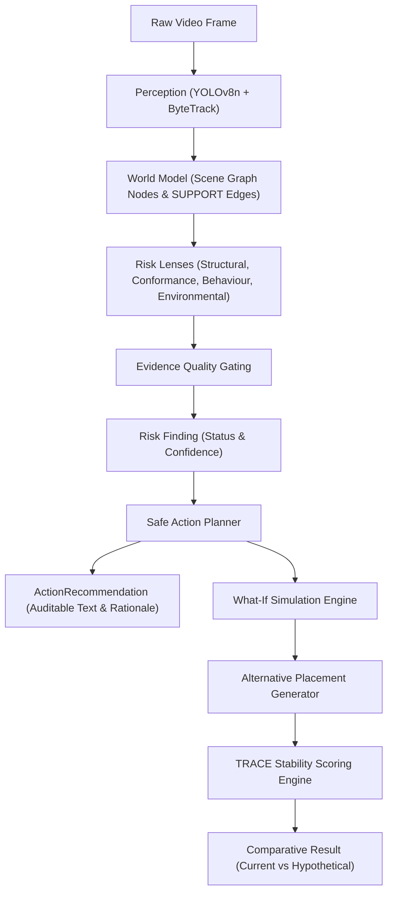

# Safe Action Planner & Evidence-Guided What-If Simulation

**Status:** Phase 7B Implemented & Verified  
**Package:** `backend.planner`, `backend.api.simulation`, `backend.api.supervisor`  
**Frontend:** `WhatIfPanel.jsx`, `HypotheticalOverlay.jsx`, `PlannerView.jsx`, `SupervisorSettings.jsx`  

---

## 1. Planner Architecture

The Safe Action Planner is the decision intelligence layer that converts verified perception, world model scene graphs, and risk findings into auditable, operator-facing recommendations and counterfactual what-if simulations.



---

## 2. Non-Negotiable Epistemic Decision Rules

TRACE enforces a strict distinction between:
- **WHAT WAS OBSERVED** (2D bounding boxes, pixel displacements, aspect ratios)
- **WHAT TRACE INFERS** (image-space support hypotheses, probable overhangs)
- **WHAT TRACE RECOMMENDS** (operational actions and geometric realignments)

### Evidence States & Action Protocol

| Finding Status | Planner Action Behavior | What-If Availability | Explanation / Rationale |
| :--- | :--- | :---: | :--- |
| **`SUPPORTED`** | Direct operational recommendation (`"Immediate precaution: ..."`) | **Yes** | Sufficient multi-frame visual and operational evidence clears all confidence gates. |
| **`PROBABLE`** | Evidence-based recommendation (`"Verification required: ..."`) | **Yes** | Probable evidence observed; corrective action recommended as precaution pending physical verification. |
| **`INSUFFICIENT_EVIDENCE`** | **Refuses corrective instruction**: `"Additional evidence is required before recommending a corrective placement."` | **No** | Sensor evidence does not clear confidence/temporal gates to justify physical intervention. |
| **`UNSUPPORTED`** | **Refuses finding**: `"TRACE cannot safely determine this condition from available evidence."` | **No** | Perception channels or operational metadata unmapped. Never hallucinate claims. |

---

## 3. Scenario to Action Mapping

Recommendations are deterministic, auditable, and non-generative (no LLM in the core decision loop):

1. **`heavy_on_light_stacking`**: Move heavier load to a lower/base position and ensure adequate support.
2. **`dropping_or_throwing_precursor`**: Slow the transfer and place the carton in a controlled trajectory.
3. **`dragging_precursor`**: Use pallet jack or team lift; do not drag cartons across floor surfaces.
4. **`rolling`**: Insufficient evidence unless rotational evidence is available.
5. **`strap_handling`**: Unsupported unless strap/hand evidence exists.
6. **`stepping_on_carton`**: Step off cartons immediately; use access stairs or designated safety ramp.
7. **`wrong_product_orientation`**: Rotate package to specified upright orientation before placement.
8. **`pallet_overhang`**: Re-center the load within the available pallet support footprint.
9. **`box_overhang`**: Align upper carton with supporting package edges; eliminate base overhang before adding upper tiers.
10. **`entity_in_dock_edge_zone`**: Move the worker away from the hazardous dock/vehicle gap.
11. **`entity_in_wet_floor_zone`**: Stop/redirect handling until calibrated wet-floor area is clear or controlled.
12. **`unplanned_loading_sequence`**: Unsupported until WMS/ERP loading-order metadata exists.
13. **`solo_heavy_handling`**: Request team lift or use mechanical pallet jack for heavy items.
14. **`wrong_equipment`**: Unsupported until equipment taxonomy exists.
15. **`unsupported_bending_placement`**: Reposition the object so its support overlap is substantially improved.
16. **`image_space_support_hypothesis`**: Verify the lower item's load capacity and stacking stability before continuing.

---

## 4. TRACE Stability Score Formula

> [!IMPORTANT]
> **EPISTEMIC DISCLAIMER:**
> The TRACE Stability Score is an image-space decision-support metric, NOT a certified physical stability measurement. No 3D depth, friction, center of gravity, or mechanical load-bearing forces are measured by the camera.

The score operates on observable normalized image-space coordinates and linked SKU metadata:

$$\text{Raw Score} = 0.40 \cdot S_{\text{support}} + 0.20 \cdot S_{\text{centering}} + 0.20 \cdot S_{\text{mass}} + 0.20 \cdot S_{\text{ori}} - 0.25 \cdot P_{\text{overhang}}$$

$$\text{TRACE Stability Score} = \text{round}(\max(0, \min(100, \text{Raw Score})), 1)$$

### Component Definitions:
1. **$S_{\text{support}}$ (Support Alignment, 0–100)**:
   Horizontal overlap ratio between target and support footprint: $\text{overlap} = \frac{\text{intersection width}}{\min(w_{\text{target}}, w_{\text{support}})}$. For ground base tier: $100$.
2. **$S_{\text{centering}}$ (Centering Alignment, 0–100)**:
   Offset between target and support bounding box centers: $1.0 - \frac{|c_{\text{target}} - c_{\text{support}}|}{\max(1e-4, w_{\text{support}} / 2)}$. For ground base tier: $100$.
3. **$S_{\text{mass}}$ (Mass Ordering, 0–100)**:
   - Light on Heavy (ideal): $100$
   - Equal Mass Stacking: $85$
   - Heavy on Light (crushing hazard): $0$ (or $30$ if medium on light)
   - Base Tier / Ground: $100$
   - Unlinked metadata baseline: $70$
4. **$S_{\text{ori}}$ (Orientation Conformance, 0–100)**:
   Conforms to required aspect ratio ($w/h \le 1.15$ for vertical, $w/h \ge 0.85$ for horizontal): $100$. Otherwise: $20$.
5. **$P_{\text{overhang}}$ (Overhang Penalty, 0–100)**:
   Percentage of target width extending past support footprint edges: $\frac{\text{left\_overhang} + \text{right\_overhang}}{w_{\text{target}}} \times 100$.

### Standard Score Bands
- **$80.0\text{--}100.0$**: `high_geometric_support`
- **$60.0\text{--}79.9$**: `moderate_geometric_support`
- **$40.0\text{--}59.9$**: `weak_geometric_support`
- **$0.0\text{--}39.9$**: `poor_geometric_support`

---

## 5. Alternative Candidate Generation

When a structural finding occurs, the candidate generator (`backend/planner/generator.py`) generates 2–3 scene-aware, geometrically feasible alternative placements:

- **Heavy-on-light**:
  1. Base tier placement directly on floor adjacent to stack ($S_{\text{mass}} = 100, S_{\text{support}} = 100$).
  2. Invert stack order (place heavy item as base foundation, light on top).
  3. Centered placement on supporting foundation.
- **Overhang / Unsupported bending**:
  1. Centered on support deck ($P_{\text{overhang}} = 0$).
  2. Inward translation with positive safety margin.
  3. $90^\circ$ rotation to match aspect ratio.
- **Wrong orientation**:
  1. Rotate upright to vertical this-side-up orientation.
  2. Rotate upright and center on support foundation.

### Feasibility Constraints
Candidates are always returned (so the operator sees why one is unsafe) but a
candidate failing any hard constraint is flagged `feasibility = false` /
`hard_constraints_passed = false`, is sorted below every feasible candidate, and
is never auto-selected as the recommendation:
- Non-degenerate footprint: width, height $> 0.02$.
- Not pinned against the frame boundary ($x_1, y_1 > 0.011$ and $x_2, y_2 < 0.989$) —
  a clamped candidate describes a box that may not physically fit.
- Worker safety clearance: no collision with detected `PERSON` entities ($\text{IoU} > 0.20$).
- No collision with any other cargo/structural entity ($\text{IoU} > 0.10$), excluding the
  target being moved and its own support deck.
- Not an unsupported cantilever: footprint does not protrude past the support deck's
  horizontal extent by more than $0.05$ (normalized).

### Shared epistemic gate
Both the single-frame engine (`planner/simulation.py`) and the multi-frame
trajectory engine (`planner/whatif.py`) route every refusal through
`planner/eligibility.py::whatif_refusal` — one allowlist
(`WHAT_IF_ELIGIBLE_SCENARIOS`), one worker-entity check, one evidence-status
check. The trajectory engine no longer defaults an unrecognised scenario to
`box_overhang`; an unspecified or non-structural scenario is refused.

---

## 6. What-If Simulation Engine

- **State Isolation**: The simulation engine creates copies of node geometries; the recorded world model and perception cache are NEVER mutated.
- **Explainable Comparison**: Every simulation exposes current vs hypothetical scores and component breakdowns.
- **Visual Overlay**: Hypothetical bounding boxes are rendered in distinct dashed emerald styling labeled `WHAT-IF (HYPOTHETICAL)` to prevent confusion with real detections.

---

## 7. Supervisor Configuration

Configured via `/api/config/...` endpoints:
- **Product Metadata**: Defines SKU mass class (`LIGHT`, `MEDIUM`, `HEAVY`), fragility, required orientation, and max stack height.
- **Environmental Zones**: Polygon calibration for dock gaps and wet floor hazard zones ($\ge 3$ vertices).
- **Source Manifests**: Assigns camera views to scheduled operational bays, SKUs, and zones.

---

## 8. API Endpoints

```http
POST /api/videos/{video_id}/what-if
Content-Type: application/json

{
  "timestamp": 2.0,
  "finding_scenario": "heavy_on_light_stacking",
  "candidate_id": "cand_base_tier",
  "model": "pilot"
}
```

```http
GET /api/videos/{video_id}/what-if?timestamp=2.0&scenario=heavy_on_light_stacking&model=pilot
```

```http
GET /api/config/products
POST /api/config/products
GET /api/config/zones
POST /api/config/zones
GET /api/config/manifests
POST /api/config/manifests
```
